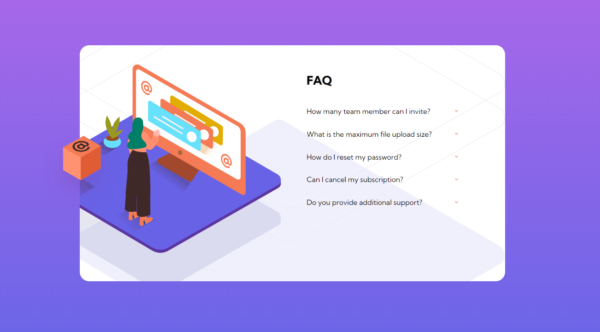

# Frontend Mentor - FAQ accordion card solution

This is a solution to the [FAQ accordion card challenge on Frontend Mentor](https://www.frontendmentor.io/challenges/faq-accordion-card-XlyjD0Oam). Frontend Mentor challenges help you improve your coding skills by building realistic projects. 

### Screenshot

**Desktop**

**Desktop Active & Hover**

### Built with
- Semantic HTML5 markup
- CSS custom properties
- Sass
- Flexbox
- CSS Grid
- Vanilla JavaScript
